# Dockerización de una Aplicación NestJS y GitHub Actions

En este repositorio se ilustra el proceso de Dockerización de una aplicación NestJS y la implementación de un flujo de trabajo en GitHub Actions para la construcción y despliegue de contenedores Docker.

## Pasos a Seguir

### 1. Creación del Repositorio

Comienza creando un repositorio en GitHub, ya sea público o privado.

### 2. Preparación del Código Fuente

Realiza un commit con el código deseado.
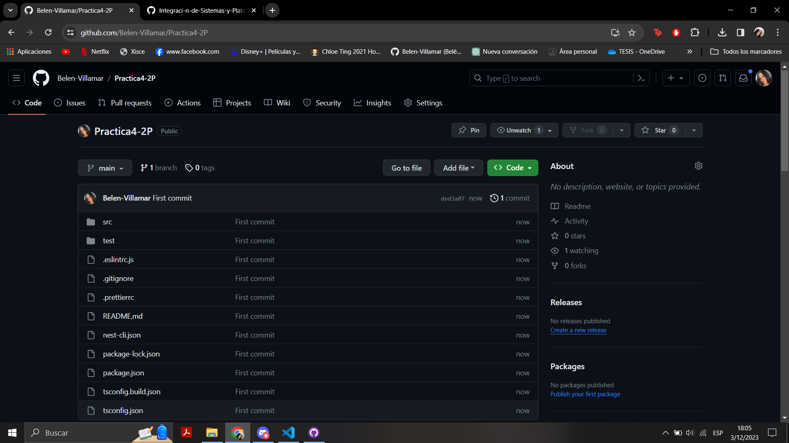

### 4. Configuración de Secrets en GitHub

Configura los secrets DOCKER_USER y DOCKER_PASSWORD en la sección correspondiente de Secrets en el repositorio de GitHub.
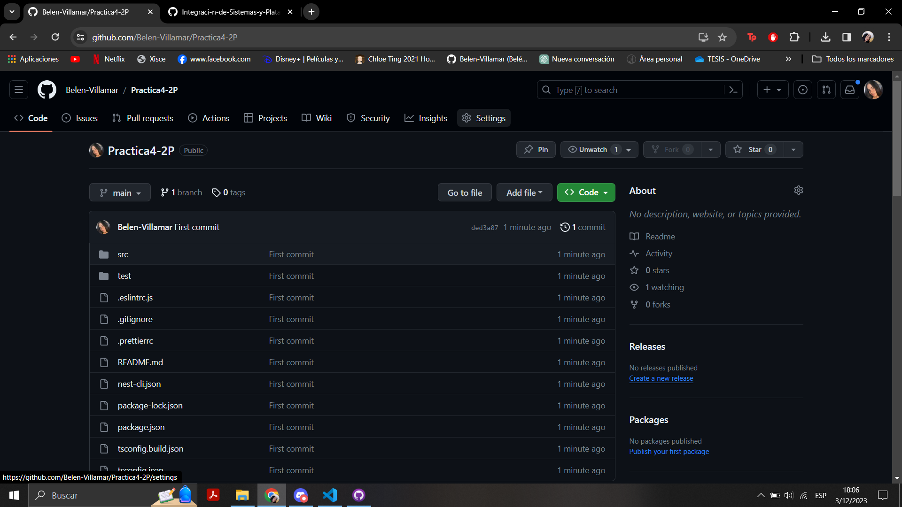
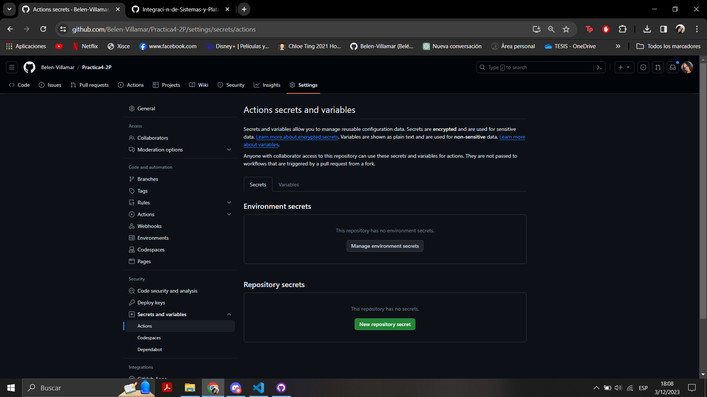
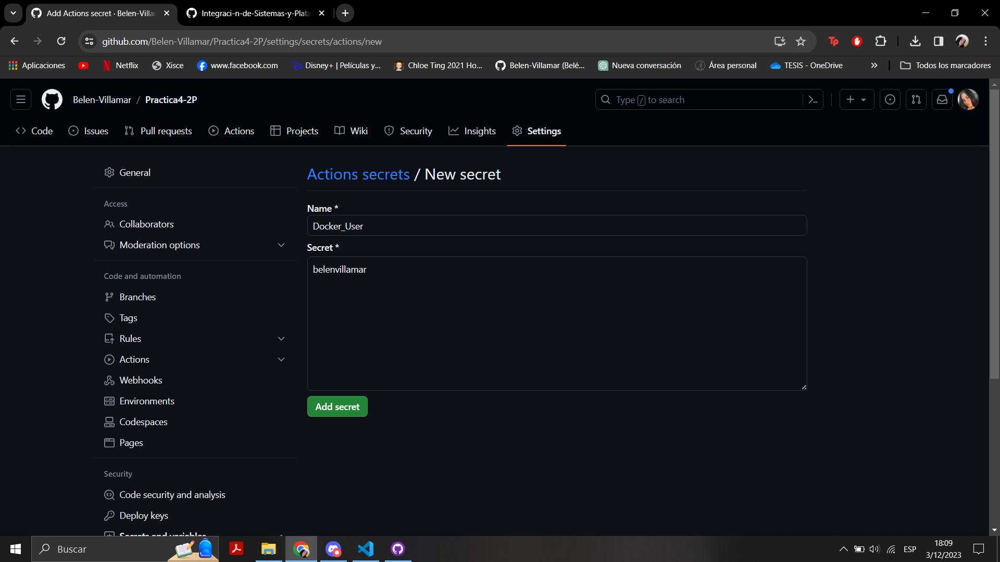

### 5. Configuración del Token de Docker Hub

Utiliza el nombre de usuario y la clave (token) de Docker Hub para llenar los secrets DOCKER_USER y DOCKER_PASSWORD. Crea un Token en Docker (con el nombre Github-Actions) y copia este Token generado en el secret DOCKER_PASSWORD.
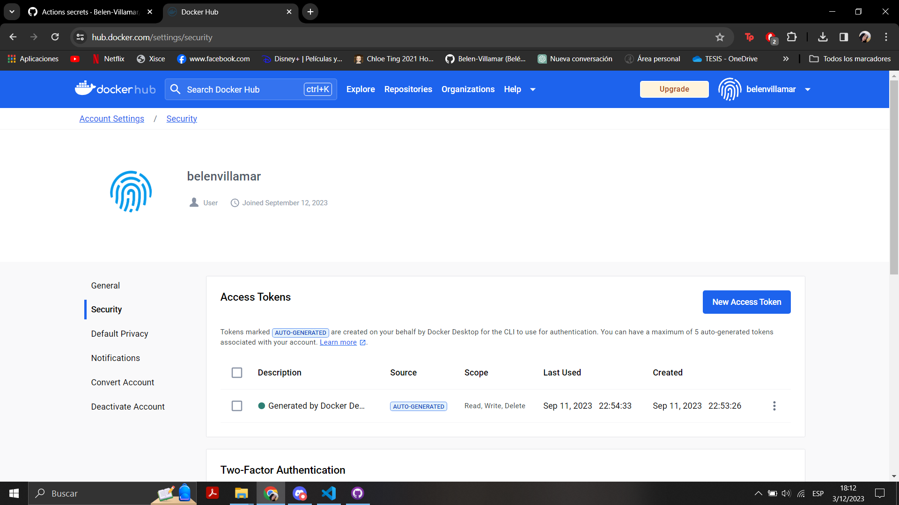
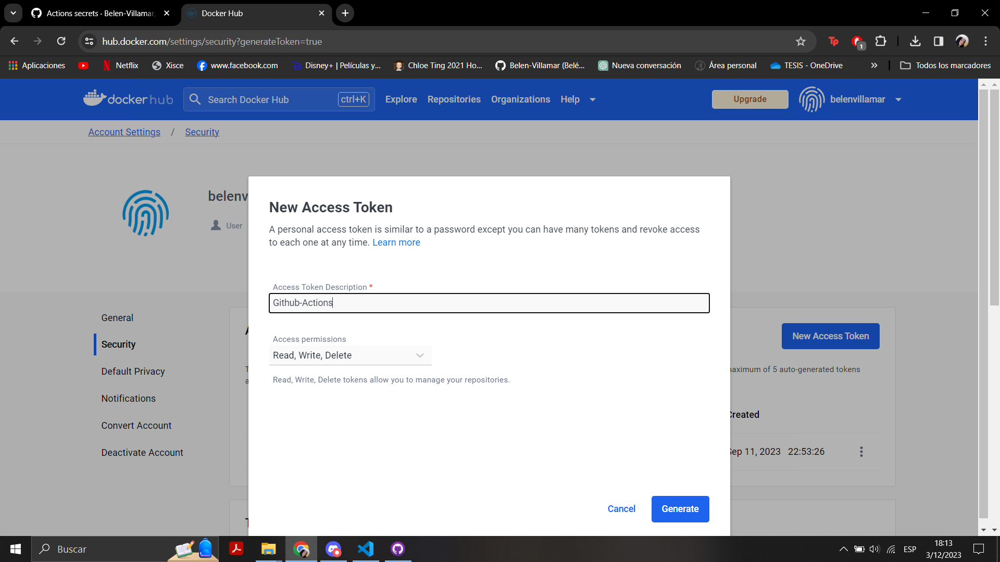
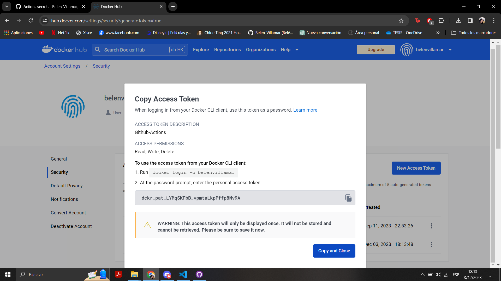

### 6. Dockerización de la Aplicación

Realiza la Dockerización de la aplicación NestJS, preferiblemente un servicio REST o GraphQL sin dependencias.
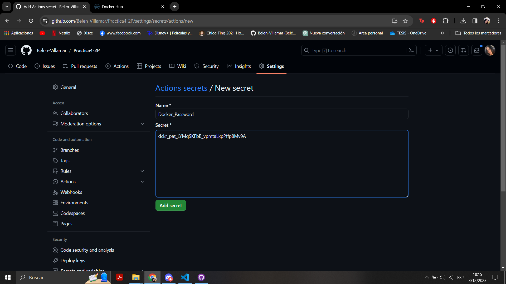
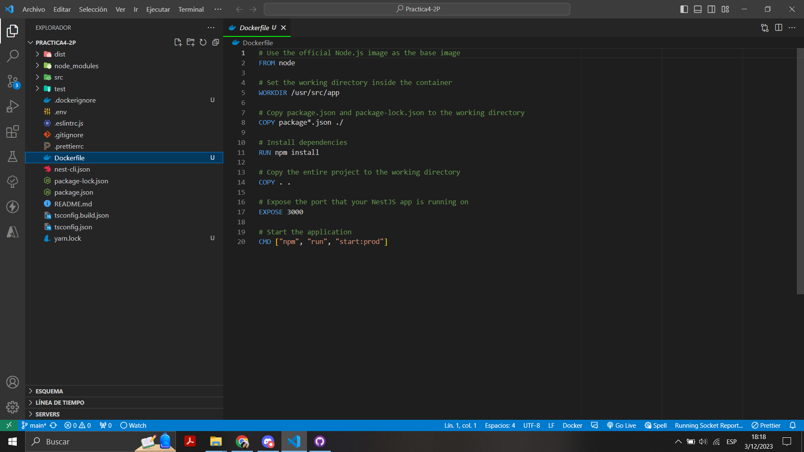

### 7. Verificación de la Construcción y Funcionamiento

Asegúrate de que la imagen pueda ser compilada.
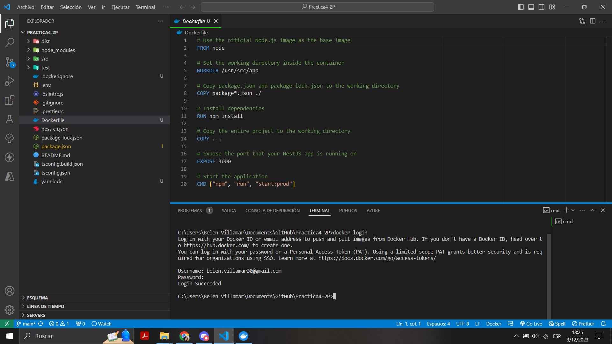
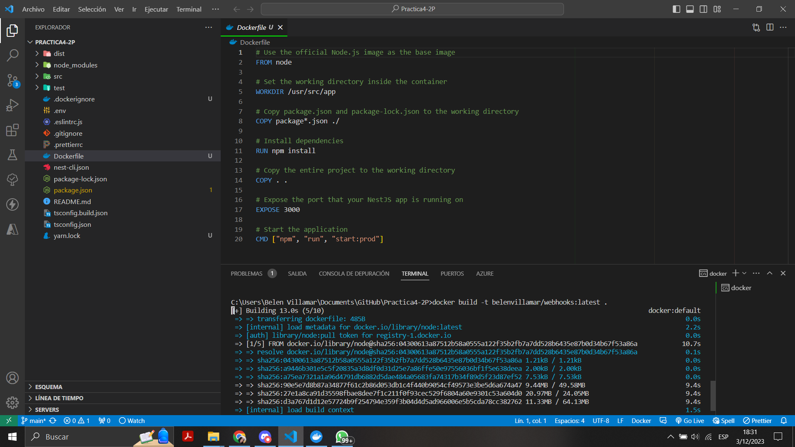

Haz el commit para que se realicen los builds automáticos.
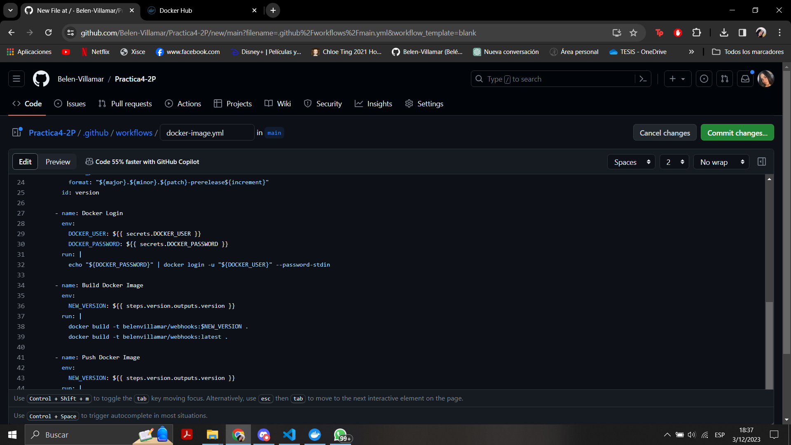

### 8. Creación de la Acción de Imagen Docker

Configura un flujo de trabajo en GitHub Actions para generar la imagen Docker utilizando el archivo `docker-image.yml`.
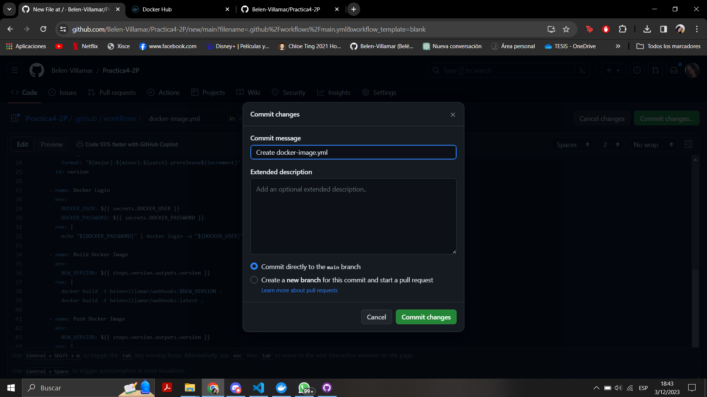

#### Evidencias

- **El flujo de trabajo está configurado para realizar builds automáticos.**
  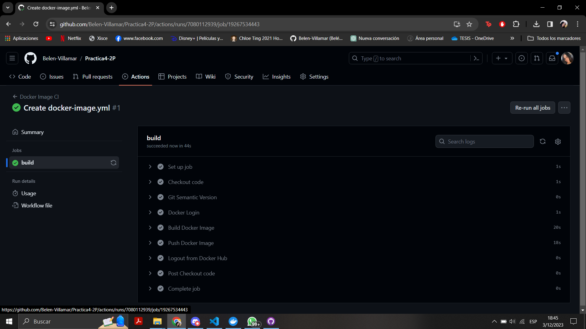

- **Durante el guardado, se genera un nuevo build automáticamente.**
  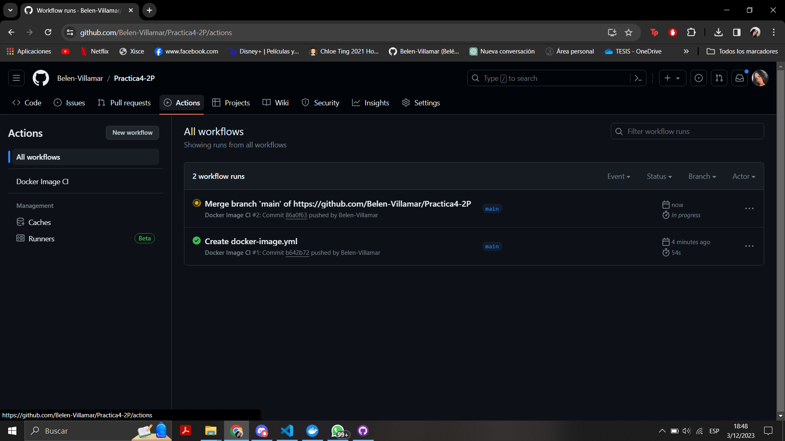

- **Build completado sin errores.**
  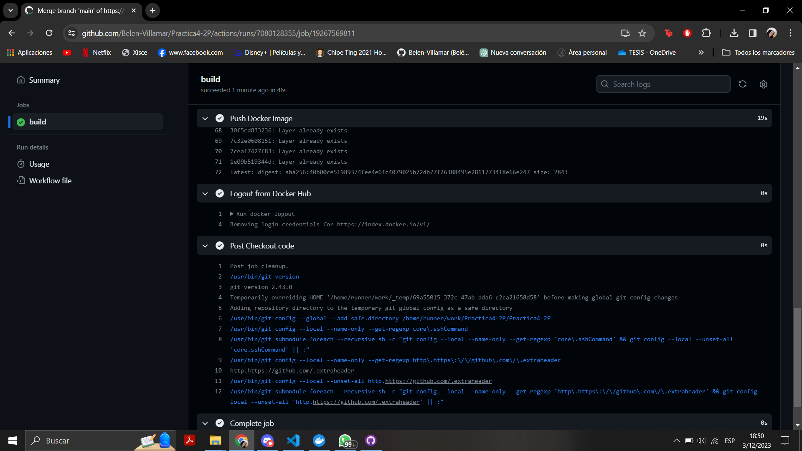

